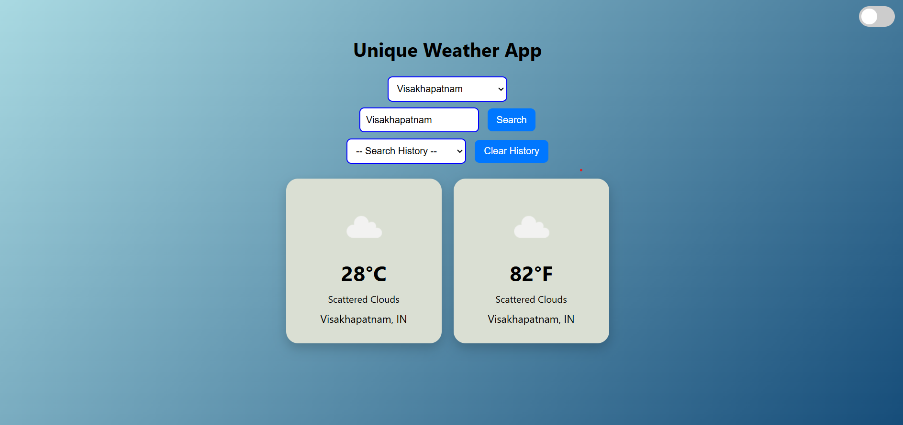

# 🌦️ Unique Weather App

A sleek, interactive weather application built using **HTML**, **CSS**, and **JavaScript** with smooth animations, a dark/light mode switch, and support for both **Celsius** and **Fahrenheit**. Easily view the weather of your city or choose from a list of popular cities.



---

## ✨ Features

- 🔍 **Search Weather by City**  
  Input any city or select from prebuilt cities like Hyderabad, Delhi, Mumbai, etc.

- 🌡️ **Displays Temperature in Celsius and Fahrenheit**  
  View both temperature units side-by-side in beautiful cards.

- 🌙 **Dark/Light Mode Toggle**  
  Seamlessly switch between dark and light modes using a smooth sliding toggle at the top.

- 🧊 **Animated Weather Icons**  
  Weather icons update dynamically based on current conditions.

- 📜 **Search History**  
  Keeps track of previous searches.

- 🧼 **Clear History Button**  
  Easily reset your weather search history.

- 🎨 **Smooth Hover Effects and Transitions**  
  Polished and responsive user interface.

---

## 🛠️ Tech Stack

- **HTML5**
- **CSS3 (with variables and transitions)**
- **Vanilla JavaScript**
- **OpenWeatherMap API**

---

## 📦 Installation

1. Clone the repository:
   ```bash
   git clone https://github.com/yourusername/unique-weather-app.git
   cd unique-weather-app
